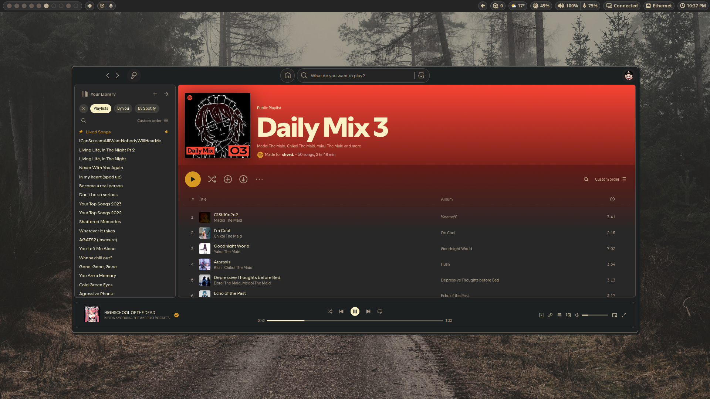

<div align="center">

[](https://git.io/typing-svg)

# Gruvin' - systemd driven Hyprland setup

</div>

<table border="1">
  <tr>
    <td></td>
    <td></td>
  </tr>
  <tr>
    <td></td>
    <td></td>
  </tr>
  <tr>
    <td></td>
    <td></td>
  </tr>
</table>

> More examples with videos can be found [here](./SHOWCASE.md)

## Let's talk about this more

The idea behind this setup is to fully utilize **systemd** and its session management capabilities. Every application, every window, bar, service, game, or anime you watch in mpv - everything is controlled by **systemd** thanks to **uwsm**.  

This helps properly manage the session, improves process management (since every application is a **systemd service**), and, most importantly, ensures proper user session shutdown.

Some parts of the code remain from my old rice but have been heavily modified.  
Additionally, in almost every file, you'll find extremely detailed comments explaining what, how, and why a particular piece of code does what it does, so you definitely won't get frustrated.

### Features:

- **Automatic suspend based on your phone availability.** If you've used KDE Connect, you probably liked the feature that prevented the system from automatically suspending when your mobile device was connected to your PC. You'll find the exact same functionality in this setup. Additionally, **on top of that**, you can connect to the MTP server running on your phone with just one click.
- **Windows-like logout screen**. When you end your session, a fullscreen logout window will launch and remain active until all applications have closed. You can find a screenshot of it [here]().
- A very well-configured and visually appealing Waybar. You can learn more about it [here]().
- More useful information for yourself can be found in the `$XDG_CONFIG_HOME/hypr/scripts` folder and in `$HOME/.scripts`.

## Installation

To install:

```bash
git clone https://github.com/shvedes/dotfiles --branch main
cd dotfiles
./install.sh
```
The `./install.sh` script will inform you about all the actions it will perform, install all the necessary packages listed in `pkg.list`, create backups of your old configs, and even allow you to perform a selective installation.

### To Do

- More precise window regex for specific windows. Currently, it doesn't work quite as intended.
- On the screenshots above, you might have already noticed custom styles for some websites. They are ready and functional, but I want to completely rework them to make them easier to maintain.

