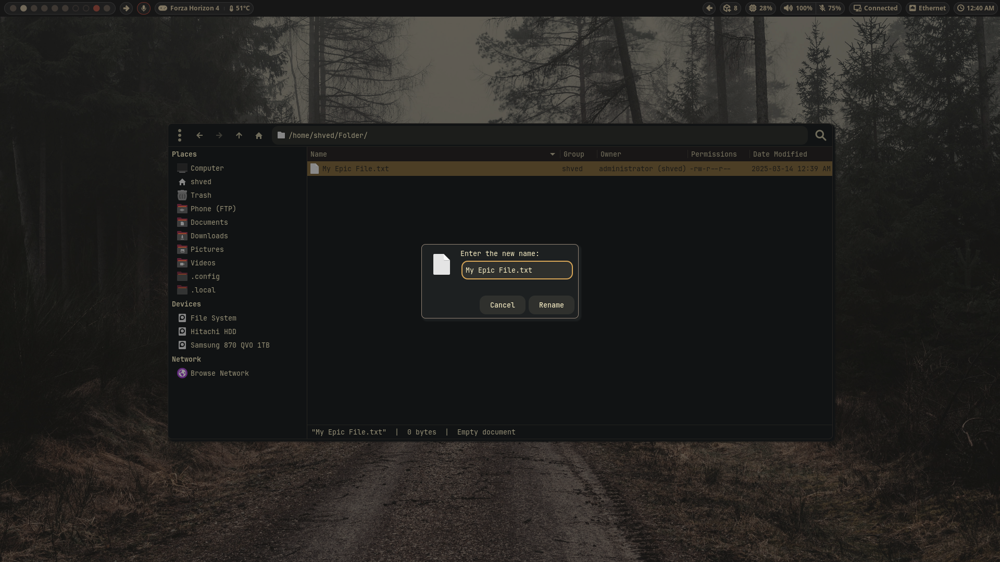
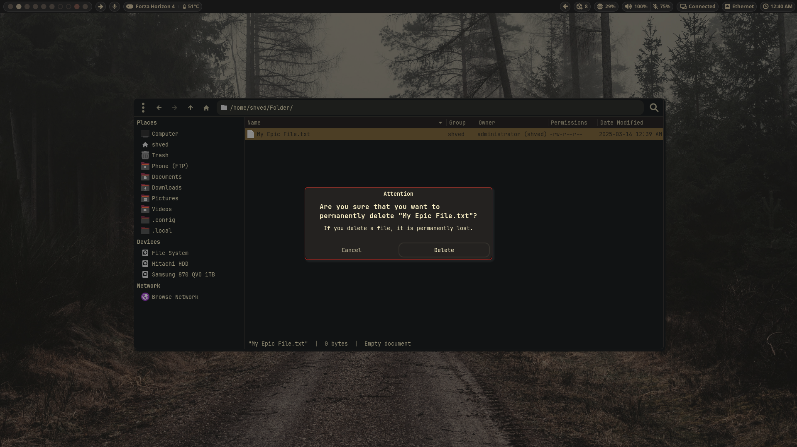

#### Waybar Customizations

https://github.com/user-attachments/assets/8a7c1bf2-081b-4c81-865c-efddb5e06065

1. Waybar natively supports controlling three media players: **Spotify, MPD, and Lofi**. For MPD, you need the `mpd-mpris` package.  
2. If a window requires attention, the virtual desktop where it is located will **flash red**, notifying the user.  
3. When an application uses the **microphone or screen sharing**, the corresponding module will have a **blinking border** to draw attention. When neither is active, the module will be hidden.  
4. If you use **gamescope**, launching a game will create a module displaying the **game title and GPU hotspot temperature**. Clicking the module will switch to the virtual desktop where the game is running.  
5. To save space, all **hardware monitoring** is grouped into a single module. Hovering over it expands the module, displaying **detailed system info**, including uptime.  
6. **Bluetooth**: When no device is connected, the module is **hidden**. By default, it shows only the **connected device name**. If the device reports battery status, it will also be displayed.  
7. **System / Microphone Volume**: Similar to Waybar’s default behavior but with **swayosd integration**, which displays an OSD for volume and mute status changes.  
8. **Phone Connection**: As mentioned in the README, when the specified **IP address is unreachable**, the module **hides**, and **hypridle** (automatic sleep) is enabled.

A more illustrative example for the phone-connection module. Also, keep in mind that all functionality is outside of Waybar, specifically in the systemd module and the script associated with it.

https://github.com/user-attachments/assets/352c231d-75c1-4846-a311-7dd0855dc8f5

#### Download Youtube / Twitch / Reddit Videos Using Rofi

Note: `yt-dlp` is required

https://github.com/user-attachments/assets/c541409c-87dd-4b43-be30-d9dde3d1b731

#### Specific Window Rules for File Operations

In these examples, everything around the windows that interact with files will be dimmed to add immersion. For instance, if you want to permanently delete a file or folder (this applies not only to Thunar), in addition to the dimming, the window will also have a bright red border.

##### Screenshot / Video Recording Effects

When you take a screenshot of the entire screen, Hyprland will briefly load a custom shader, creating a flash effect. It will not affect the content of the screenshot or screen recording.

Also, if you take a screenshot of the active window, instead of the full-screen flash effect, the effect will be applied as a border around the window.

https://github.com/user-attachments/assets/faa417b3-af44-4d26-820b-b6a773bc46f6

#### Clipboard 

The clipboard is managed through rofi, just like all other functions.

https://github.com/user-attachments/assets/9f987c1e-7b95-48b7-ae9e-a1e23fd727a2

