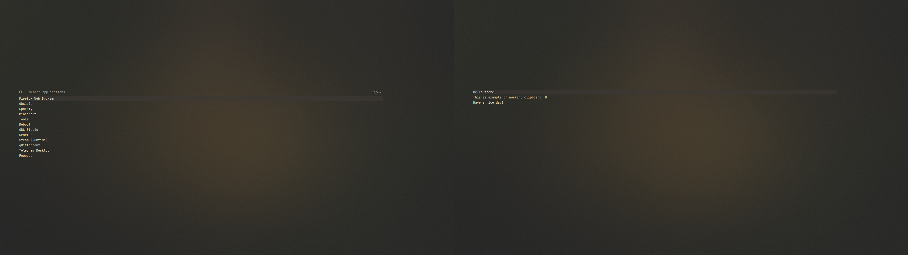
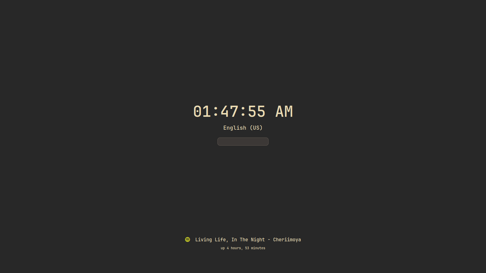
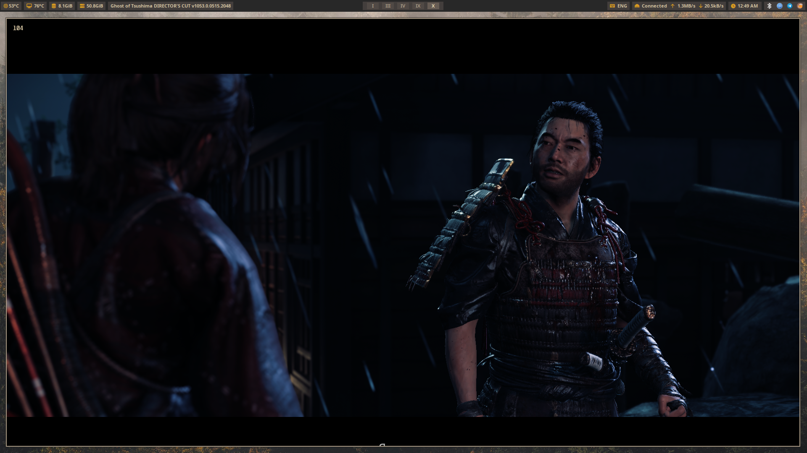
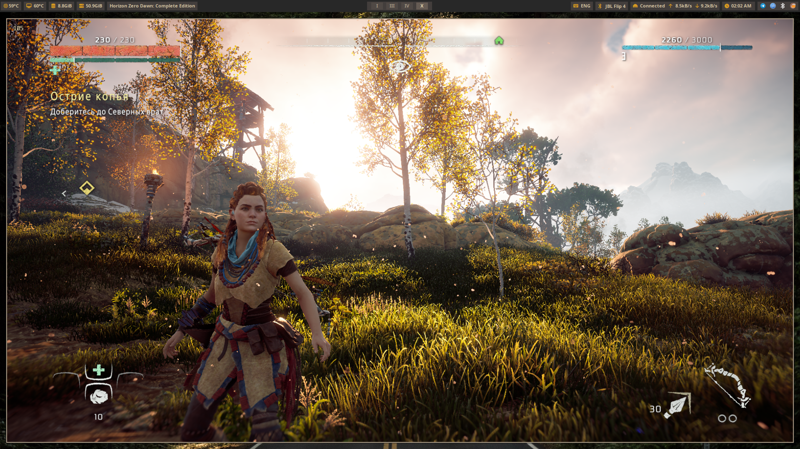
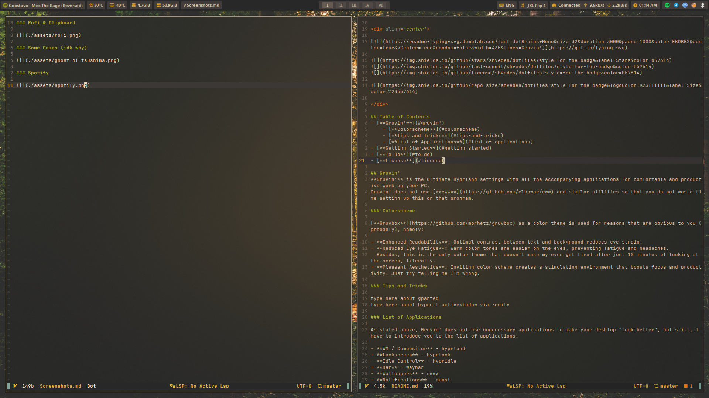
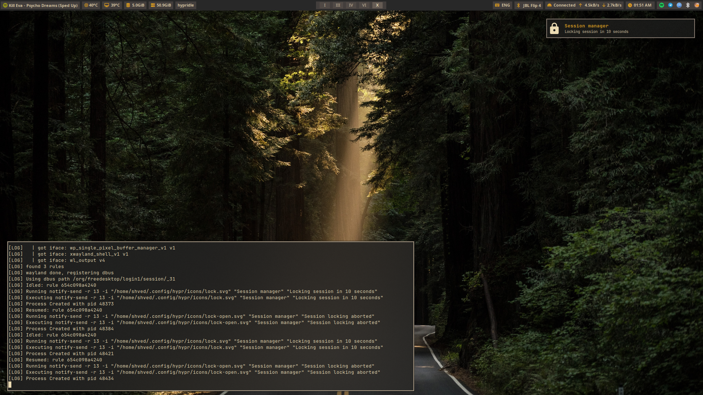
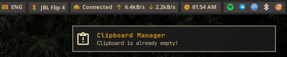
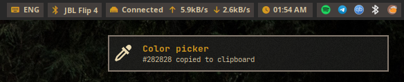
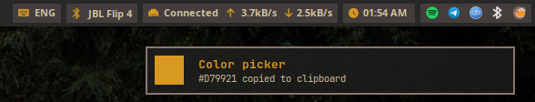
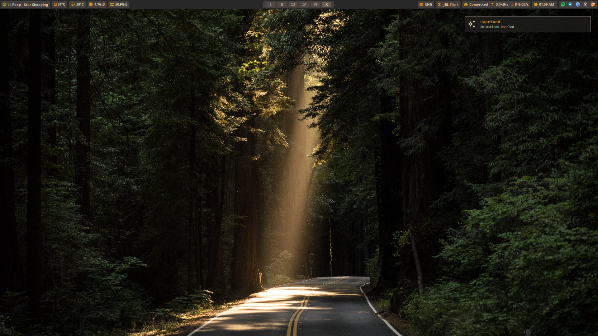

### Rofi & Clipboard (adapted for 1920x1080)

### Lockscreen (adapted for 1920x1080)

### Some Games (idk why)

### Spotify 

### Workflow stuff

### Environment

If clipboard is already has been clean

"imagemagick is used to convert a pixel color selected from the screen into a small image that will be displayed in a notification. If this package is not available, a pre-prepared svg image will be used."

Here is an example

If `imagemagick` not installed

if `imagemagick` is installed

Animations enabled / disabled

