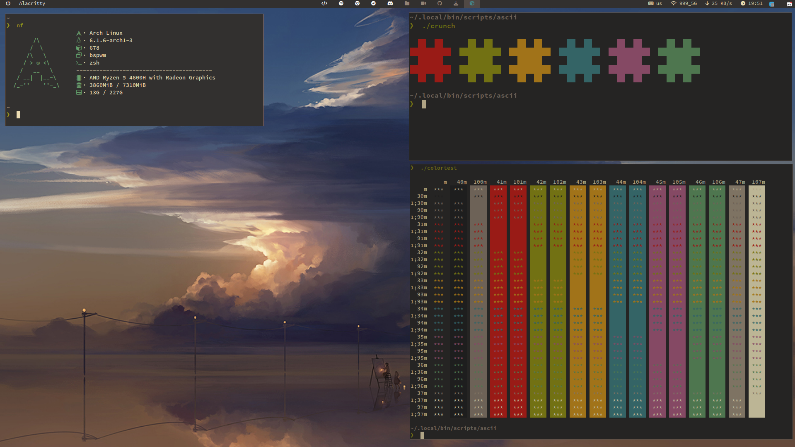
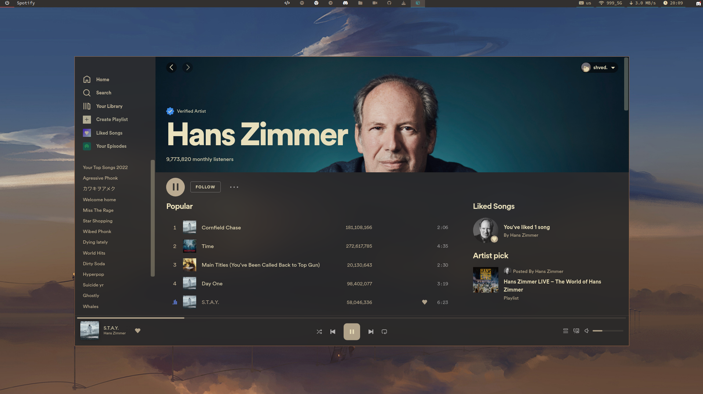
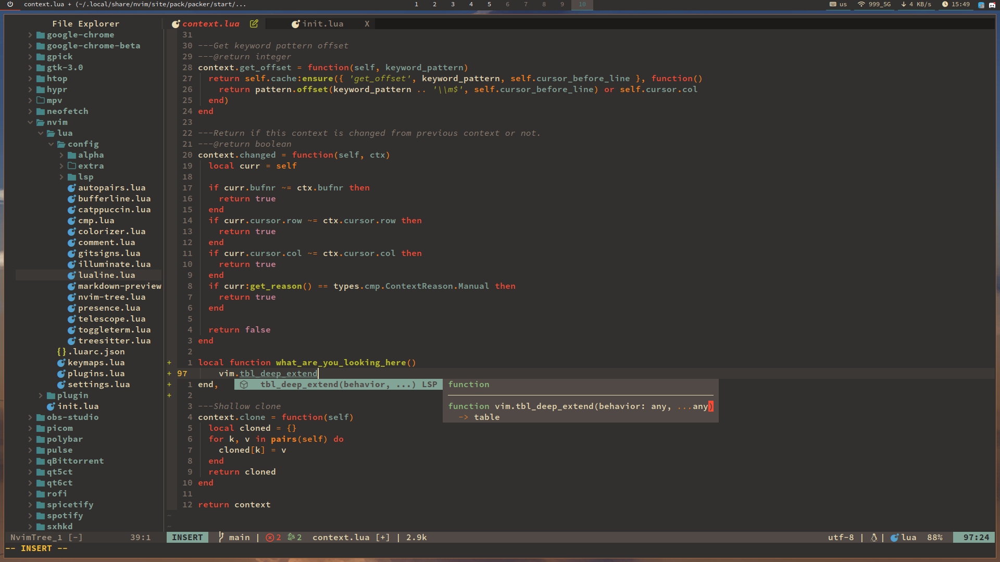
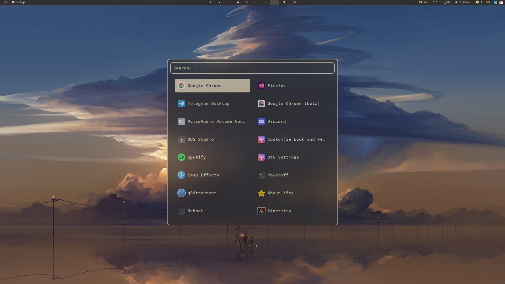
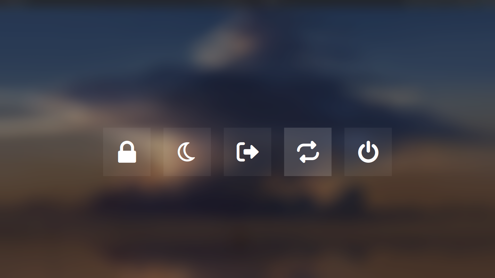
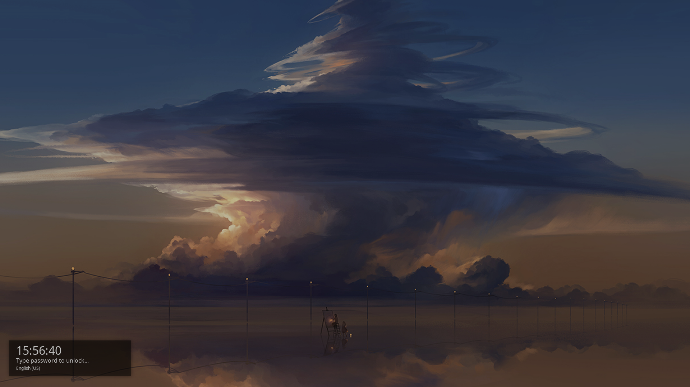

<p align="center">
  
</p>

<p align="center">
  <b> ~ Minimalistic BSPWM dotfiles ~ </b>
</p>


<div align="center">
     
     
     
</div>


<div align="center">
<p><h2>Overview</h></p>

|  |  |
| --- | --- |
|  |  |
|  |  |

</div>

# **Table of contents** 

- **[Environment](#Environment)**
- **[Features](#features)**
- **[Appearance](#Appearance)**
  - **[Aviables themes](#aviable-themes)**
  - **[Color schemes that I plan to add](#color-schemes-that-i-plan-to-add-list-can-grow)**
  - **[Icons](#icons)**
  - **[Cursors](#cursors)**
- **[Neovim](#Neovim)**
- **[Dependencies](#dependencies)**
- **[ToDo](#ToDo)**
- **[Shortcuts](#bspwm-shortcuts)**
- **[Known issues](#known-issues)**

## **Environment**

| Parameter | Link |
| --- | --- |
| **OS** | **[Arch Linux](https://archlinux.org/)** |
| **Editor** | **[Neovim](https://github.com/neovim/neovim)** | 
| **Browser** | **[Firefox](https://www.mozilla.org/en-US/firefox/new/), [Google Chrome](https://www.google.com/chrome/)** |
| **Terminal** | **[Alacritty](https://github.com/alacritty/alacritty)** |
| **Screenshot tool** | **[Maim](https://github.com/naelstrof/maim)** |
| **Compositor** | **[Picom](https://github.com/dccsillag/picom)** |
| **App launcher** | **[Rofi](https://github.com/davatorium/rofi)** |
| **Clipboard** | **[Greenclip](https://github.com/erebe/greenclip)** |
| **GUI file manager** | **[Thunar](https://github.com/xfce-mirror/thunar)** | 
| **Screen locker** | **[Betterlockscreen](https://github.com/betterlockscreen/betterlockscreen)** |
| **QT theme selector** | **[qt5ct](https://github.com/desktop-app/qt5ct), [qt6ct](https://github.com/trialuser02/qt6ct)** |
| **GTK theme selector** | **[Lxappearance](https://github.com/lxde/lxappearance)** |
| **GUI Volume managment** | **[Pavucontrol](https://github.com/pulseaudio/pavucontrol)** |
| **Color picker** | **[Gpick](https://www.gpick.org)** |

## **Features**

- **Battery critical level / fully charged alert (udev rule)**
- **Battery staus notifications (AC source or battery, udev rule)**
- **USB flash drive plug / unplug notifications (udev rule)**
- **Volume / Brightness / Microphone notifications**
- **Multiple monitors support (eDP / HDMI)**
- **Compositor animations**
- **Wifi menu (via rofi)**
- **Color picker (with copy to clipboard)**


### **Appearance**

#### **Aviable themes**

- **[Catppuccin Mocha](https://github.com/catppuccin/catppuccin)**
- **[Gruvbox Dark](https://github.com/morhetz/gruvbox)**

#### **Icons**

- **[Stylish](https://github.com/kuroehanako/Stylish-icon-theme)**

#### **Cursors**

- **[Catppuccin](https://github.com/catppuccin/cursors)**
- **[Material Light](https://github.com/varlesh/material-cursors)**

#### **Color schemes that I plan to add**

- **[Gruvbox Light](https://github.com/morhetz/gruvbox)**
- **[OneDark](https://github.com/navarasu/onedark.nvim/blob/master/lua/onedark/palette.lua)**

### **Neovim**

**You can find my Neovim configuration [here](https://github.com/shvedes/nvim)**

### **Dependencies**

**All dependencies aviable in `DEPENDENCIES` file. You can install them by typing:**

```
git clone https://github.com/shvedes/dotfiles --branch=next
cd dotfiles
yay -S --neended --noconfirm $(cat DEPENDENCIES)
```

### **ToDo**

- **OneDark**
- **Gruvbox Light**

### **Shortcuts**

| Parameter   | Keymap |
|    ---      |   ---  | 
| **Windows** |        |
| Close window | Super + Q | 
| Kill window | Super + Shift + Q |
| Focus left | Super + J |
| Focus right | Super + K |
| Focus bottom | Super + L |
| Focus top | Super + Semicolon |
| Swap left | Super + Shift + J |
| Swap right | Super + Shift + K |
| Swap bottom | Super + Shift + L |
| Swap top | Super + Shift + Semicolon |
| Resize window | Super + Shift + ArrowKeys |
| **Modes** |         | 
| Floating mode | Super + Shift + F |
| Fullscreen mode | Super + F |
| Pseudo tiled mode | Super + T |
| Monocle mode | Super + M |
| **Workspaces** | |
| Next Workspace | Ctrl + Alt + Right | 
| Previous Workspace | Ctrl + Alt + Left |
| Last used Workspace | Super + Tab |
| Workspace {number} | Super + (1-9,0) |
| Move window to Workspace | Super + Shift + (1-9,0) |
| **Monitors** | | 
| Move window to second monitor | Ctrl + Alt + N |
| Focus on next / prev monitor | Super + Shift + N |
| **Screenshots** | |
| Fullscreen | Super + Shift + Z |
| Active window | Super + Shift + A |
| Area | Super + Shift + S |
| **BSPC** | | 
| App launcher | Super  + A |
| Clipboard menu | Super + V |
| Clear clipboard | Super + Shift + V |
| Change wallpaper | Super + Shift + W |
| Reload BSPWM | Super + Shift + R |
| Quit BSPWM | Super + Shift + Q |
| Power menu | Super + P |
| **Apps** | | 
| Open Terminal | Super + Return | 
| Open drop-down terminal | Super + Shift + Return | 
| Spotify (if installed) | Ctrl + Alt + S | 
| Firefox (if installed) | Ctrl + Alt + F |
| Chrome (if installed) | Ctrl + Alt + C |


## **Known issues**

<details>
<summary><b>Transparent windows flickering (picom fork issue)</b></summary>
    
</details>

---
<div align="center"></div>

<div align="center">
     
</div>

